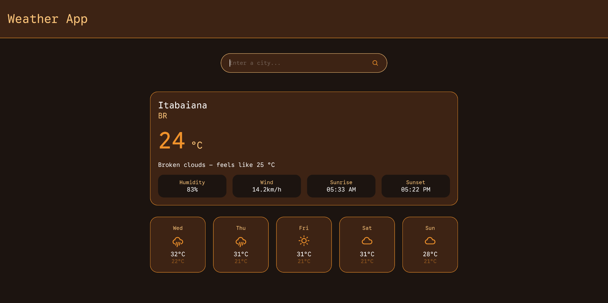

# 🌤️ Weather App
 
A clean, responsive weather app built with React and the OpenWeather API. Search for any city in the world and get current conditions plus a 5-day forecast.
 
---
 
## 📸 Preview
 

 
---
 
## ✨ Features
 
- 🔍 Search any city in the world
- 🌡️ Current temperature, weather condition and icon
- 💧 Humidity and wind speed
- 📅 5-day forecast with daily temperature and rain probability
- 🌍 Correct local time for any city's timezone
- 📱 Fully responsive — works on mobile, tablet and desktop
---
 
## 🛠️ Tech Stack
 
- [React](https://react.dev/) — UI library
- [Vite](https://vitejs.dev/) — build tool
- [OpenWeather API](https://openweathermap.org/api) — weather data
---
 
## 🚀 Getting Started
 
### 1. Clone the repository
 
```bash
git clone https://github.com/danideoliv/weather-app.git
cd weather-app
```
 
### 2. Install dependencies
 
```bash
npm install
```
 
### 3. Set up your API key
 
Create a `.env` file at the root of the project:
 
```
VITE_API_KEY=your_openweather_api_key_here
```
 
You can get a free API key at [openweathermap.org](https://openweathermap.org).
 
### 4. Start the development server
 
```bash
npm run dev
```
 
The app will be available at `http://localhost:5173`.
 
---
 
## 📁 Project Structure
 
```
src/
├── components/
│   ├── Header.jsx
│   ├── SearchBar.jsx
│   ├── CurrentWeather.jsx
│   └── Forecast.jsx
├── hooks/
│   └── useWeather.js
├── services/
│   └── weatherApi.js
├── css/
│   ├── App.css
│   ├── Header.css
│   ├── SearchBar.css
│   ├── CurrentWeather.css
│   └── Forecast.css
├── App.jsx
└── main.jsx
```
 
---
 
## 🔌 API Endpoints Used
 
| Endpoint | Purpose |
|---|---|
| `/data/2.5/weather` | Current weather by city name |
| `/data/2.5/forecast` | 5-day / 3-hour forecast by city name |
 
 
---
 
## 📖 What I Learned
 
This was my first React project. Throughout building it I learned:
 
- How to consume a REST API with `fetch` and `async/await`
- How to manage state with `useState` and side effects with `useEffect`
- How to build and use a custom React hook
- How to work with Unix timestamps and timezones
- How to parse and filter JSON data from an API
- How to make a responsive layout with Flexbox and media queries
---
 
## 📄 License
 
This project is open source and available under the [MIT License](LICENSE).
 
